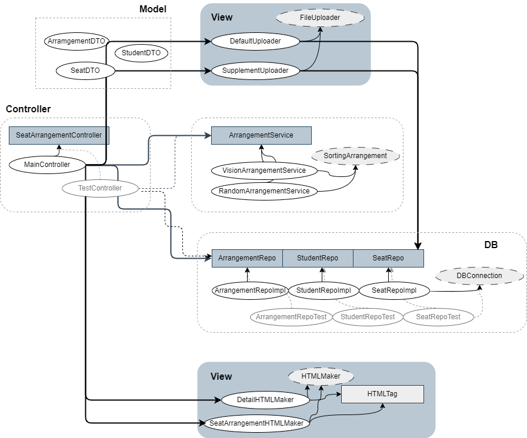
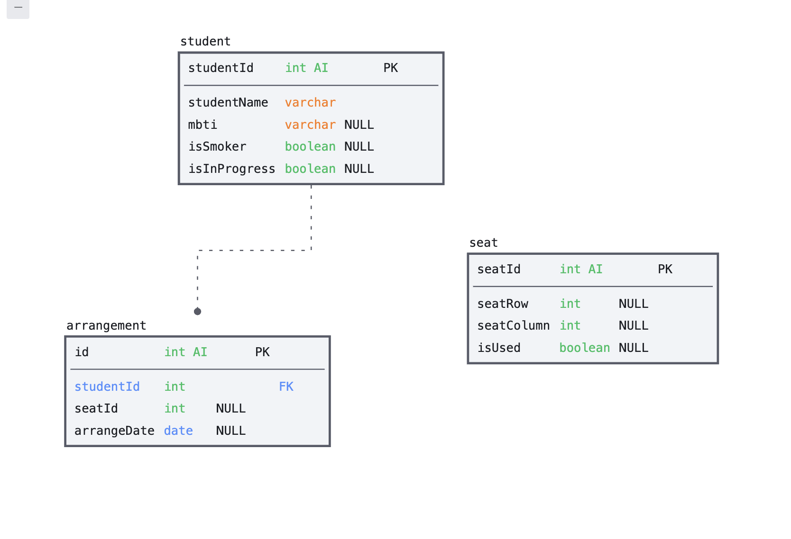

# 🚀프로젝트 정보
## 📌 과제
### 필수 포함
- MySQL 사용
- Java(Thread, Collection, Inheritance) 적용
- HTML(html 파일 생성, 이미지, 링크)
### 기간
3일: 23. 6. 7(금) ~ 23. 6. 9(일)
## 🔍 소개
&nbsp; 부트캠프 첫 미니 프로젝트로 랜덤 자리 배치 기능을 구현했습니다. 

### 기획 배경
&nbsp; 같은 반 수강생의 자리를 일주일마다 바꾸지만, 좌석 표에 출석 번호만 기재되어 있습니다. 
- 좌석 표를 참고해 이름을 외우기 어려웠습니다.
- 시력이 좋지 않은 수강생의 경우 앞좌석으로 배치하고자 했으나 매니저님이 사용하는 프로그램으로는 적용이 불가했습니다. 

&nbsp; 위의 문제를 해결하고자, 이름과 번호가 기재된 사진을 표에 배치하고, 시력별 배치가 가능한 애플리케이션을 기획하게 되었습니다.

## 🔧 사용 기술 및 개발 환경
IntelliJ, Java 11, MySQL

# 🏗 프로젝트 구조
## 📚 클래스 다이어그램

## 💾 ERD

# 🤯 고민한 점
- **Java 코드의 변경 없이** text 설정 파일의 변경만으로 다양한 좌석에서 다양한 배치를 적용할 수 있어야 합니다.
  - **하드 코딩을 금지**하고, text 파일 정보 파싱을 통해 배치와 html 생성에 필요한 숫자를 뽑아내어 구현했습니다.
  - **인터페이스**로 좌석 배치에 필요한 기능을 강제하고, **구현체의 변경** 만으로 일반 랜덤 배치와 시력 별 랜덤 배치를 선택할 수 있도록 구현했습니다.

# 🔆 빌드
## 사용 방법
&nbsp; util 패키지의 텍스트 파일과 이미지 파일을 설정해야 합니다. 현재 텍스트 파일은 다음의 좌석을 기준으로 합니다.
>&nbsp;&nbsp;&nbsp;&nbsp;&nbsp;&nbsp;&nbsp;&nbsp;&nbsp;&nbsp;&nbsp;&nbsp;&nbsp;&nbsp;&nbsp;&nbsp;&nbsp;&nbsp;&nbsp;&nbsp;&nbsp;&nbsp;&nbsp;&nbsp;&nbsp;(     앞     ) 
(1, 1) (1, 2)&nbsp;&nbsp;&nbsp;&nbsp;&nbsp;(1, 3) (1, 4) (1, 5) (1, 6) 
(2, 1) (2, 2)&nbsp;&nbsp;&nbsp;&nbsp;&nbsp;(2, 3) (2, 4) (2, 5) (2, 6) 
(3, 1) (3, 2)&nbsp;&nbsp;&nbsp;&nbsp;&nbsp;(3, 3) (3, 4) (3, 5) (3, 6) 
(4, 1) (4, 2)&nbsp;&nbsp;&nbsp;&nbsp;&nbsp;(4, 3) (4, 4) (4, 5) (4, 6) 
(5, 1) (5, 2)&nbsp;&nbsp;&nbsp;&nbsp;&nbsp;(5, 3) (5, 4) (5, 5) (5, 6) 
(6, 1) (6, 2)&nbsp;&nbsp;&nbsp;&nbsp;&nbsp;(6, 3) (6, 4) (6, 5) (6, 6) 

📂 util/datafile/default 
📂 suppliment 
📄 seat_not_used_row_column.txt 
사용하지 않는 자리의 정보를 입력합니다. 
📄 student_isSmoker_id.txt 
흡연자의 출석 번호를 입력합니다. 
📄 student_not_inProgress_id.txt 
탈주한 학생의 출석 번호를 입력합니다. 
📄 seat_data.txt 
직사각형의 형태가 되는 좌석 정보를 입력합니다. 
📄 student_data.txt 
학생 정보를 이름, MBTI, 시력 순으로 입력합니다.

📂  util/datafile/images 
🏞 0.png 
🏞 1.png 
🏞 2.png 
... 
0번은 빈 좌석에 해당하는 이미지, 외에는 출석 번호에 해당하는 학생의 이미지를 저장합니다.

